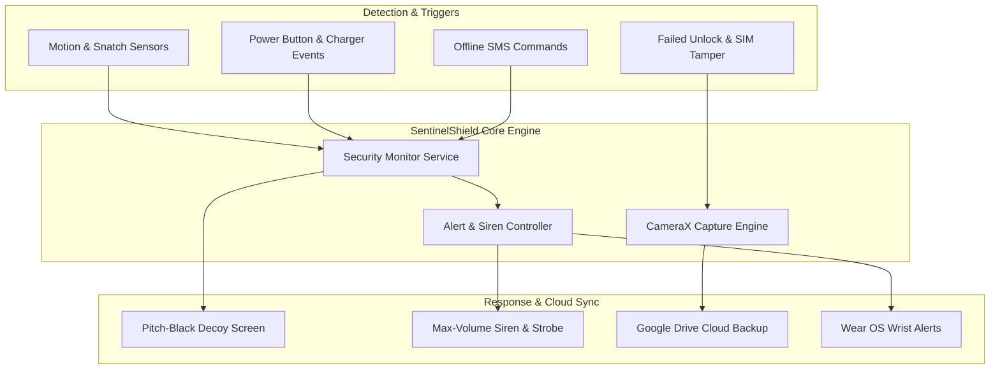

<div align="center">


# SentinelShield

### Open-source Android anti-theft and device protection suite

[](https://developer.android.com)
[](https://developer.android.com)
[](https://kotlinlang.org/)
[](https://developer.android.com/jetpack/compose)

*SentinelShield is an open-source Android security app that counters common phone theft tactics: physical power-offs, charger disconnects, pocket snatches, and SIM swaps. It captures evidence locally and lets you control the device remotely over SMS without relying on external tracking servers.*

</div>

---

## Features

### Fake power menu and decoy shutdown
* Intercepts physical power button long-presses before the system power dialog appears.
* Shows a realistic stock Pixel power menu with Power off, Restart, Lockdown, and Emergency options.
* Tapping Power off or Restart triggers a haptic vibration and switches to a pitch-black fullscreen overlay (`DecoyScreenActivity`). The device looks powered down while background security monitors stay active.

### Pocket snatch detection
* Uses proximity and accelerometer sensors to detect when the phone is pulled from a pocket or bag.
* Configurable 5-second arming delay and 3-second grace period prevent false alarms.
* Fires a max-volume siren (`SecurityAlertService`) with an optional camera strobe flash.

### Charging disconnect monitor
* Watches USB and wireless charging connections in real time.
* Triggers an alarm immediately if the charging cable is unplugged while armed.

### SIM tamper detection
* Tracks SIM subscription state through `TelephonyManager` and `SubscriptionManager`.
* Detects SIM card removals and slot swaps, sending an SMS alert to a designated backup contact.

### Intruder selfie and evidence capture
* Uses CameraX to capture a front-camera photo or a 3-second HD video after two failed lock screen attempts.
* Stores timestamped files in local storage (`DCIM/SentinelShield`) and queues them for Google Drive backup.

### Google Drive cloud backup
* Backs up intruder photos, videos, and diagnostic logs to a dedicated `SentinelShield` folder in your personal Google Drive.
* Uses OAuth 2.0 with minimal `drive.file` scope.

### Remote SMS control
* Accepts commands from trusted contact numbers even when offline or without mobile data.
* `LOCK`, `LOCKDOWN`, or `LOST`: locks the screen through Device Admin policy.
* `SIREN`, `ALARM`, `SOUND`, or `RING`: sounds the emergency siren at max volume.
* `STOP`, `SILENCE`, `DISARM`, or `MUTE`: silences an active alarm remotely.
* `LOCATION`, `TRACK`, `GPS`, `LOCATE`, or `WHERE`: enables Location and Mobile Data (via `WRITE_SECURE_SETTINGS`), settles satellite fixes, and texts back a Google Maps link (`https://maps.google.com/maps?q=loc:LAT,LNG&z=17`).
* Includes an in-app setup helper and copyable ADB command for granting `WRITE_SECURE_SETTINGS`:
  ```bash
  adb shell pm grant com.sentinelshield.antitheft android.permission.WRITE_SECURE_SETTINGS
  ```

### Wear OS companion
* Smartwatch module (`:wear`) lets you trigger an emergency SOS alarm and view protection status from your wrist.

---

## Design and interface

The UI is built with Jetpack Compose and Material 3:
* Supports Material You dynamic colors along with custom theme palettes.
* Pure dark and AMOLED modes save battery on OLED screens.
* Audio playback enforces maximum alarm volume every 500ms, holds a CPU `PARTIAL_WAKE_LOCK`, and requests transient exclusive audio focus.

---

## Architecture and tech stack



* **Architecture:** MVVM and Clean Architecture with Kotlin Coroutines and StateFlow.
* **UI:** Jetpack Compose with Material 3 components and Navigation Compose.
* **Background services:** Android Foreground Services (`START_STICKY`, `FOREGROUND_SERVICE_TYPE_MEDIA_PLAYBACK`) with CPU `WakeLock` management.
* **Hardware interception:** Custom `AccessibilityService` (`PowerButtonAccessibilityService`) for global power key events.
* **Hardware APIs:** CameraX, SensorManager, TelephonyManager, AudioManager, FusedLocationProviderClient.

---

## Building and running from source

### Prerequisites
* Android Studio Ladybug (2024.2.1) or newer
* JDK 17+
* Android SDK 35 (Android 15)

### Setup

1. **Clone the repository:**
   ```bash
   git clone git@github.com:ShivaSchauhan/SentinelShield.git
   cd SentinelShield
   ```

2. **Open in Android Studio:**
   * Launch Android Studio, select **Open**, and navigate to the project directory.

3. **Build debug APK:**
   ```bash
   ./gradlew assembleDebug
   ```

4. **Install on device or emulator:**
   ```bash
   ./gradlew installDebug
   ```

---

## Privacy and security

* **No telemetry:** SentinelShield includes no third-party tracking, analytics, or remote data collection libraries.
* **Local storage:** Security logs, photos, and settings stay on your device or in your personal Google Drive account.
* **Owner authentication:** Alarms require native PIN, pattern, or biometric unlock to disarm.
